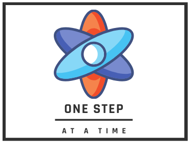

# [One Step at a Time](https://aliwualk.github.io/One-Step-at-a-Time/)

Data, Statistics, Football, Science, Python in none particular order.

- - -

The start of a series of diferent subjects, this first project will cover the journey to recreate an exercice in JASP and Python. Creating the code to do similar test and create graphics to ilustrate it.

## Table of Contents. 

JASP & Python Ecercices:

1.	[RELATIONSHIP TESTING](/exercise1.md)
