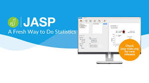

# One Step at a Time
Data, Statistics, Football, Science, Python in none particular order.
- - -
The start of a series of diferent subjects:
This first project will cover the journey to recreate an exercice in JASP and Python
Creating the code to do similar test and create graphics to ilustrate it.

# Practice Exercices in Jasp and Python
JASP Practice Statistics : https://jasp-stats.org
