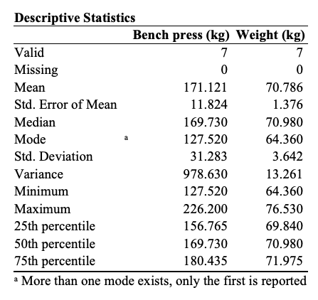

### [<BACK](/index.md)
# Practice Exercises in Jasp and Python

JASP Practice Statistics : https://jasp-stats.org

    1.	RELATIONSHIP TESTING
    
a)	Correlation Example 1

Do heavier athletes have larger maximums in the bench press?

|     Athlete:     |    A   |    B   |   C   |    D   |    E   |    F   |    G   |
|:----------------:|:------:|:------:|:-----:|:------:|:------:|:------:|:------:|
| Bench press (kg) | 127.52 | 169.62 | 226.2 | 143.91 | 169.73 | 177.36 | 183.51 |
|    Weight (kg)   |  64.36 |  69.58 |  70.1 |  71.48 |  76.53 |  70.98 |  72.47 |


NULL Hypothesis, H0:

EXPERIMENTAL Hypothesis, H1:

---
First thing to do before to work on JASP is to create a .CSV file.  

*NB: The table needs to be arraged different.
. For every athlete in the table you need to make an entry for the 2 varibles.
. The function in excel (Paste Special) 'Transpose' helps.
. And there is a function in Python that also do the transpose function.

---


```python
    import pandas as pd

    tabla_df = pd.read_csv('jasp_practice_1.csv', sep=",") # use the path of your file
    df_transposed = tabla_df.transpose()
    print(df_transposed)
    # if you want to write the new file use: df_transposed.to_csv('jasp_practice_2.csv')
```

---

#### We can see now the new csv file like we need to enter in the JSP program before starts

---


```python
    import pandas as pd

    tabla_df = pd.read_csv('jasp_practice_1.csv', index_col=0) # use the path of your file
    print(tabla_df)
```


---


| Athlete: | Bench press (kg) | Weight (kg) |
|:--------:|:----------------:|:-----------:|
|     A    |      127.52      |    64.36    |
|     B    |      169.62      |    69.58    |
|     C    |      226.20      |    70.10    |
|     D    |      143.91      |    71.48    |
|     E    |      169.73      |    76.53    |
|     F    |      177.36      |    70.98    |
|     G    |      183.51      |    72.47    |


---

##### Once we upload the file in JASP, we select the 'Descriptives' option and then Descriptive Statistics 

---



---

***From Pandas module we use the fucntion describe():***
- describe() Function gives the mean, std and IQR values. 
It excludes character column and calculate summary statistics only for numeric columns. 

---


```python
    import pandas as pd

    tabla_df = pd.read_csv('jasp_practice_1.csv', sep=",")# use the path of your file
    tabla_df.describe()
    # You could use the funtion round(tabla_df,3) to display ony 3 decimals
```


---

| Bench press (kg) | Weight (kg) | Weight (kg) |
|------------------|-------------|:-----------:|
| count            | 7.000000    | 7.000000    |
| mean             | 171.121429  | 70.785714   |
| std              | 31.283069   | 3.641592    |
| min              | 127.520000  | 64.360000   |
| 25%              | 156.765000  | 69.840000   |
| 50%              | 169.730000  | 70.980000   |
| 75%              | 180.435000  | 71.975000   |
| max              | 226.200000  | 76.530000   |

---

Another way to find out the perceptiles in Python:

---

```python
import pandas as pd
from pandas import DataFrame
tabla_df = pd.read_csv('jasp_practice_1.csv', sep=",")
df = DataFrame(tabla_df)
perc =[.20, .40, .60, .80] 
include =[ 'float', 'int'] 
desc = tabla_df.describe(percentiles = perc, include = include) 
print(desc.round(2))
```

---

|       | Bench press (kg) | Weight (kg) |
|------:|-----------------:|------------:|
| count |             7.00 |        7.00 |
|  mean |           171.12 |       70.79 |
|   std |            31.28 |        3.64 |
|   min |           127.52 |       64.36 |
|   20% |           149.05 |       69.68 |
|   40% |           169.66 |       70.45 |
|   50% |           169.73 |       70.98 |
|   60% |           174.31 |       71.28 |
|   80% |           182.28 |       72.27 |
|   max |           226.20 |       76.53 |

---


### [NEXT>](/exercise2.md)
