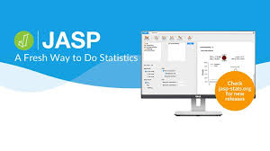

# Project: [One Step at a Time](https://aliwualk.github.io/One-Step-at-a-Time)
Data, Statistics, Football, Science, Python in none particular order.

The start of a series of different subjects, this first project will cover the journey to recreate an exercise in JASP and Python. Creating the code to do similar test and create graphics to illustrate it.

# Practice Exercises in Jasp and Python
JASP Practice Statistics : [https://jasp-stats.org]

## Table of Contents. 

JASP & Python Ecercices:

1.	[RELATIONSHIP TESTING](/exercise1.md)
